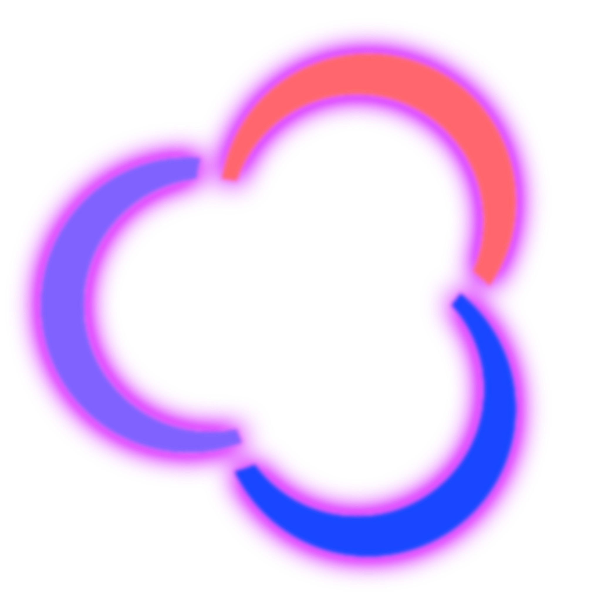

<h1 align="center">ARGON.ru</h1>

  

  
  
  

Проект возрождающий старый API OZON.ru (Partner API и т.д.) для старого приложения из 2012 года.

> Необходим патч приложения с вашей стороны, так как тут нельзя предоставлять старый APK.

Проект написан полностью на PHP 8.x, база данных находится в формате XML.

Что работает:
- Главная (OZON.ru)
  - Рекомендуемое, Новинки, Бестселлеры
- Каталог
- Корзина
- Вход
- Карточки товаров

Планируется воссоздать сайт.

- [Документация](documentation.md)

> ⚠️ **LEGAL DISCLAIMER / ЮРИДИЧЕСКИЙ ОТКАЗ ОТ ОТВЕТСТВЕННОСТИ**
> Данный проект является независимой любительской разработкой (фан-проектом) и предназначен исключительно для исследовательских целей, архивации и обеспечения совместимости со старым ПО (interoperability). 
> Проект НЕ связан с компанией ООО «Интернет Решения» (OZON), не использует их товарные знаки, защищенные серверные API, торговые марки или конфиденциальные базы данных. Все совпадения протоколов взаимодействия являются результатом независимого анализа открытых данных (clean-room reverse engineering).
